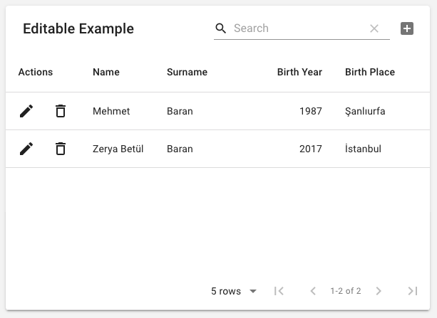

Material-UIの拡張パッケージであるmaterial-tableは表の中でアイテムの追加・編集・削除、また検索を行うことができて、導入するだけで簡単に使えるため、簡単な商品検索ページなどの実装には便利そうです。



https://github.com/mbrn/material-table

## インストール

基本はReadmeの内容をそのままやればいいのですが、Material-UIのドキュメントに書かれてるコードをそのまま動かすとアイコンが表示されません。Material-UIのアイコンを使うには別途設定する必要があります。

https://material-ui.com/components/tables/#complementary-projects

```javascript
import { forwardRef } from 'react';
import AddBox from '@material-ui/icons/AddBox';
.....

const tableIcons = {
    Add: forwardRef((props, ref) => <AddBox {...props} ref={ref} />),
      .....
  };

<MaterialTable
  icons={tableIcons}
  .....
/>
```

## その他

### デフォルトの検索機能をオフにしたい

以下を追加します。

```javascript
 <MaterialTable
   options={{
     search: false
   }}
   ....
```

### 削除時に表示されるテキストの内容を変更したい

デフォルトだと削除アイコンをクリックしたとき`Are you sure delete this row?` という文章が表示されるのですが、これを例えば日本語にしたいなど内容を変更するときは以下のようにします。

```javascript
<MaterialTable
  localization={{ body: { editRow: { deleteText: 'Customized Delete Message' } } }}
  ....
```

https://github.com/mbrn/material-table/issues/758

### アクションボタンの削除・追加

上のサンプルだと編集・削除のアクションボタンが有効になってます。これは`editable`プロパティの中で`onRowAdd`などの名前で定義されており、消したいときはその部分を修正します。

https://material-table.com/#/docs/features/editable

また独自のアクションボタンを定義したいときは`actions`に定義します。

```javascript
<MaterialTable
  // other props
  actions={[
    {
      icon: 'save',
      tooltip: 'Save User',
      onClick: (event, rowData) => {
        // Do save operation
      }
    }
  ]}
/>
```

https://material-table.com/#/docs/features/actions

